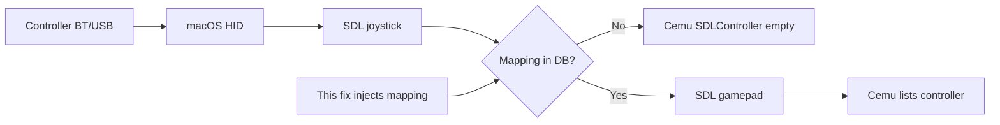

# Cemu SDL Controller Fix (macOS)

Fix empty **SDLController** list in [Cemu](https://cemu.info/) on Mac when the system sees your gamepad (e.g. **8BitDo Ultimate 2C** over Bluetooth) but Cemu’s bundled SDL 2.30.3 has no mapping for it.

**One-time install → launch Cemu from Dock as usual.** No terminal, no DSU bridge, no Steam Input.

[](https://github.com/stocktormod-design/cemu-macos-sdl-fix/releases)

## Quick start

### Option A — Double-click installer (easiest)

1. Download **CemuSDLFix.zip** from [Releases](https://github.com/stocktormod-design/cemu-macos-sdl-fix/releases) (includes **Source code** zip on the same page for audit).
2. Unzip and open **`CemuSDLFix.app`**.
3. Connect your controller → open Cemu → **Input → SDLController**.

### Option B — Terminal

```bash
git clone https://github.com/stocktormod-design/cemu-macos-sdl-fix.git
cd cemu-macos-sdl-fix
chmod +x scripts/*.sh scripts/lib/*.sh
./scripts/install_cemu_sdl_fix.sh --force
```

Uninstall: `./scripts/uninstall_cemu_sdl_fix.sh`

## Build the installer app (maintainers)

```bash
./scripts/build_cemu_sdl_launcher.sh   # if bin/ is missing
./scripts/build_cemu_sdl_fix_app.sh
zip -r CemuSDLFix.zip CemuSDLFix.app
```

## The problem this fixes

**Symptom:** In Cemu → **Input → SDLController**, the list is **empty**, while macOS Settings → Game Controllers, Steam, or a browser gamepad test **do** see your pad.

**Root cause (not a broken controller):**

1. Cemu on Mac uses an **old embedded SDL 2.30.3** gamecontroller database.
2. Cemu’s input code only enumerates **SDL gamepads** (`SDL_GetGamepads`), not every USB/BT joystick.
3. SDL treats a device as a gamepad only if it has a matching **mapping** (GUID + button layout string) in the gamecontroller DB.
4. Newer pads (e.g. **8BitDo Ultimate 2C** over Bluetooth) appear as joysticks with a **GUID that is missing** from Cemu’s built-in DB → SDL never promotes them to “gamepad” → Cemu shows nothing.

This is **not** fixed by Steam Input, Enjoyable, or a DSU bridge for native SDL input — those are separate paths. This project fixes the **SDL mapping gap** inside Cemu’s own controller API.

## Why this fix works



At startup we inject an updated database **before** Cemu initializes SDL:

| Step | What happens |
|------|----------------|
| 1 | A tiny **launcher** (open source, ~50 KB) runs as the app’s main executable. |
| 2 | It sets `SDL_GAMECONTROLLERCONFIG` (inline mappings) and `SDL_GAMECONTROLLERCONFIG_FILE` (full merged DB). |
| 3 | It `exec`s the real Cemu binary (`Cemu_Metal_arm64.real` / `Cemu.real`). |
| 4 | SDL loads the extra mappings → your GUID matches → device becomes a **gamepad** → Cemu’s SDLController list fills in. |

On recent macOS, putting those variables only in `Info.plist` (`LSEnvironment`) is **unreliable** when launching from the Dock — the launcher guarantees the env is set every time.

**Performance:** the launcher exits immediately after `exec`; no extra process while you play.

More detail: [CEMU_SDL_FIX.md](CEMU_SDL_FIX.md)

## Other controllers (not only Ultimate 2C)

**Yes — any pad that already works at the OS level can work in Cemu if SDL has the right mapping for your connection mode (USB vs BT) and OS.**

| Included in this fix | |
|----------------------|--|
| **~190 mappings** | Extracted from Cemu’s own SDL DB + community `gamecontrollerdb` entries (`scripts/data/gamecontrollerdb.txt`) — Xbox-style pads, PlayStation, 8BitDo, HORI, ROG, etc. |
| **Extra patches** | Newer devices missing from Cemu, including **8BitDo Ultimate 2C** (Mac / Windows / Linux GUID variants) in `scripts/data/gamecontroller_patches.txt` |
| **Your own pads** | Add lines to `~/Library/Application Support/Cemu/gamecontroller_user.txt`, then re-run install `--force` |

**It will work when:**

- macOS already sees the controller (Game Controllers settings or `System Settings`).
- The pad’s **SDL GUID** for that connection is in the merged DB (or you add it).

**It may still not work when:**

- The pad is **not visible to macOS at all** (driver / pairing / hardware issue).
- Only a **proprietary stack** exposes the device (no normal HID gamepad).
- Your exact GUID + connection (e.g. BT vs USB) has **no mapping** yet — add one (see below).
- You use a **different input API** in Cemu (e.g. DSU) without enabling SDL controller.

### Add support for another pad

1. Connect the pad the way you play (BT or USB).
2. Find its SDL GUID (Homebrew SDL test, or run `./scripts/sdl_cemu_diagnose.sh`).
3. Copy a similar mapping from [SDL gamecontrollerdb](https://github.com/mdqinc/SDL_GameControllerDB) or generate one with [SDL2 Gamepad Tool](http://www.generalarcade.com/gamepadtool/).
4. Append to `gamecontroller_user.txt` and run `./scripts/install_cemu_sdl_fix.sh --force`.

If you add a mapping that helps others, open a PR to extend `gamecontroller_patches.txt`.

## Security & antivirus (transparency)

macOS may warn about an unsigned helper — expected. This repo is **100% open source**:

- Audit [`scripts/cemu_sdl_launcher/launcher.c`](scripts/cemu_sdl_launcher/launcher.c) (only `setenv` + `exec` into `*.real`)
- Rebuild and check hashes: `./scripts/verify_build.sh`
- Each release ships **Source code** + [RELEASE_CHECKSUMS.txt](RELEASE_CHECKSUMS.txt)

See [SECURITY.md](SECURITY.md).

## Requirements

- macOS 13+
- Cemu (Metal and/or vanilla `.app`)
- Writable Cemu.app bundle (Applications or user folder)

## Custom mappings

Add lines to `~/Library/Application Support/Cemu/gamecontroller_user.txt`, then re-run install with `--force`.

## License

MIT — see [LICENSE](LICENSE). Not affiliated with Cemu or 8BitDo.
